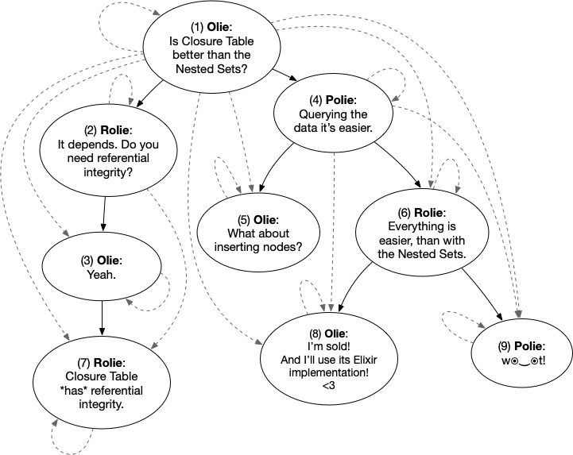

# Closure Table

[](https://hex.pm/packages/closure_table)
[](https://hexdocs.pm/closure_table)

The Closure Table solution is a simple and elegant way of storing hierarchies. It involves storing all paths through a tree, not just those with a direct parent-child relationship. You may want to chose this model, over the [Nested Sets model](https://en.wikipedia.org/wiki/Nested_set_model), should you need referential integrity and to assign nodes to multiple trees.

Throughout the various examples and tests, we will refer to the hierarchies depicted below, where we're modeling a hypothetical forum-like discussion between [Rolie, Olie and Polie](https://www.youtube.com/watch?v=LTkmaE_QWMQ), and their debate around the usefulness of this implementation :)



Warning:

> This version is introducing major breaking changes. We drop the concept of a CT Adapter and focus on using Ecto, for the core functions. The (in)memory adapter is gone.


## Quick start

The current implementation is depending on Ecto ~> 3.1; using [Ecto.SubQuery](https://hexdocs.pm/ecto/Ecto.SubQuery.html)!

For this implementation to work you'll have to provide two tables, and the name of the Repo used by your application:

1. a table name containing the nodes. Having the `id`, as a the primary key. This is the default for now - configurable in the near future
2. a table name where the tree paths will be stores.
3. the name of the Ecto.Repo, defined by your app

In a future version we will provide you with a convenient migration template to help you starting, but for now you must supply these tables.

For example, given you have the following Schemas for comments:

```elixir
      defmodule CT.Comment do
        use Ecto.Schema
        import Ecto.Changeset

        @timestamps_opts [type: :utc_datetime]

        schema "comments" do
          field :text, :string
          belongs_to :author, CT.Author

          timestamps()
        end
      end
```

and a table used for storing the parent-child relationships

```elixir

      defmodule CT.TreePath do
        use Ecto.Schema
        import Ecto.Changeset
        alias CT.Comment

        @primary_key false

        schema "tree_paths" do
          belongs_to :parent_comment, Comment, foreign_key: :ancestor
          belongs_to :comment, Comment, foreign_key: :descendant
          field :depth, :integer, default: 0
        end
      end
```

we can define the following module:

```elixir

      defmodule CT.MyCTE do
        use CTE,
        repo: CT.Repo,
        nodes: CT.Comment,
        paths: CT.TreePath
      end
```

We add our CTE Repo to the app's main supervision tree, like this:

```elixir
      defmodule CT.Application do
        use Application

        def start(_type, _args) do
          children = [
            CT.Repo,
          ]

          opts = [strategy: :one_for_one, name: CT.Supervisor]
          Supervisor.start_link(children, opts)
        end
      end
```

restart your application.

Then using `iex -S mix`, we can start experimenting. Examples:

```elixir
      iex» CT.MyCTE.ancestors(9)
      {:ok, [1, 4, 6]}

      iex» {:ok, tree} = CT.MyCTE.tree(1)
      {:ok,
      %{
      nodes: %{
        6 => %CT.Comment{
          __meta__: #Ecto.Schema.Metadata<:loaded, "comments">,
          author: #Ecto.Association.NotLoaded<association :author is not loaded>,
          author_id: 2,
          id: 6,
          inserted_at: ~U[2019-07-21 01:10:35Z],
          text: "Everything is easier, than with the Nested Sets.",
          updated_at: ~U[2019-07-21 01:10:35Z]
        },
        8 => %CT.Comment{
          __meta__: #Ecto.Schema.Metadata<:loaded, "comments">,
          author: #Ecto.Association.NotLoaded<association :author is not loaded>,
          author_id: 1,
          id: 8,
          inserted_at: ~U[2019-07-21 01:10:35Z],
          text: "I’m sold! And I’ll use its Elixir implementation! <3",
          updated_at: ~U[2019-07-21 01:10:35Z]
        },
        ...

      },
      paths: [
          [1, 1, 0],
          [1, 2, 1],
          [2, 2, 0],
          [1, 3, 2],
          [2, 3, 1],
          [3, 3, 0],
          [1, 7, 3],
          [2, 7, 2],
     ...
            ]
      }}
```

if you want to visualize a tree, you can do that too:

```elixir
iex» CTE.Utils.print_tree(tree, 1, callback: &({&2[&1], &2[&1].text}))
```

and you may see this:

```txt
Is Closure Table better than the Nested Sets?
├── It depends. Do you need referential integrity?
│  └── Yeah
│     └── Closure Table *has* referential integrity?
└── Querying the data it's easier.
   ├── What about inserting nodes?
   └── Everything is easier, than with the Nested Sets.
      ├── I'm sold! And I'll use its Elixir implementation! <3
      └── w⦿‿⦿t!
```

Please check the docs for more details and return from more updates!

Oh and there is a simple utility for helping you drawing your paths, using graphviz! From Rolie's comments, excerpt:


Maybe useful?! If yes, then we'll let you find this function by yourself ;)

hint: _check the tests <3_

## Installation

If [available in Hex](https://hex.pm/packages/closure_table), the package can be installed
by adding `closure_table` to your list of dependencies in `mix.exs`:

```elixir
def deps do
  [
    {:closure_table, "~> 2.0"}
  ]
end
```

## Contributing

- [Fork this project](https://github.com/florinpatrascu/closure_table/fork)
- Create your feature branch (git checkout -b my-new-feature)
- Setup database and test (`mix test`)
- Commit your changes (`git commit -am 'Add some feature'`)
- Push to the branch (`git push origin my-new-feature`)
- Create new Pull Request

## License

```txt
Copyright 2023 Florin T.PATRASCU & the Contributors

Licensed under the Apache License, Version 2.0 (the "License");
you may not use this file except in compliance with the License.
You may obtain a copy of the License at

  http://www.apache.org/licenses/LICENSE-2.0

Unless required by applicable law or agreed to in writing, software
distributed under the License is distributed on an "AS IS" BASIS,
WITHOUT WARRANTIES OR CONDITIONS OF ANY KIND, either express or implied.
See the License for the specific language governing permissions and
limitations under the License.
```
